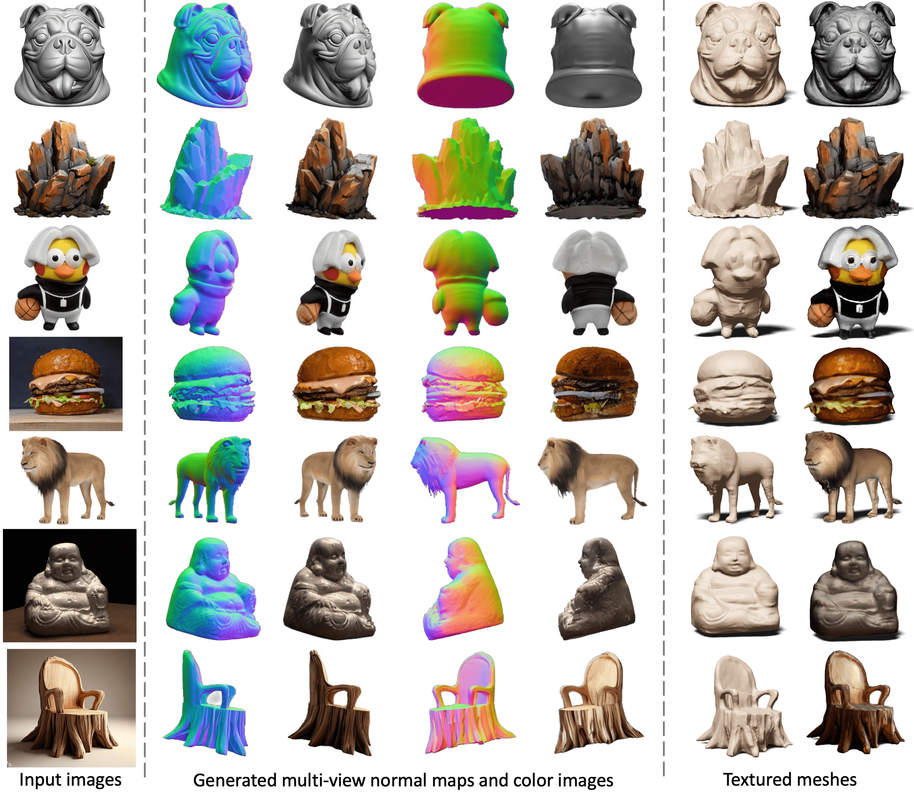
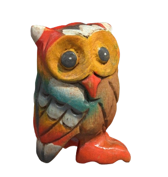
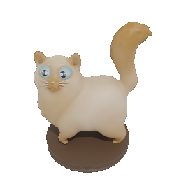
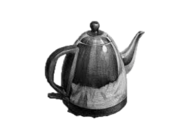
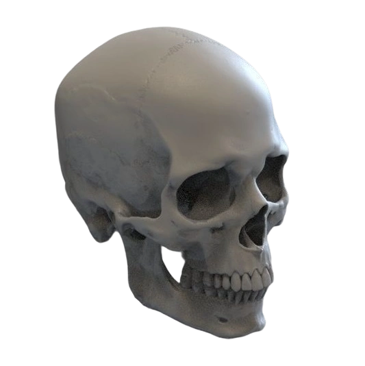
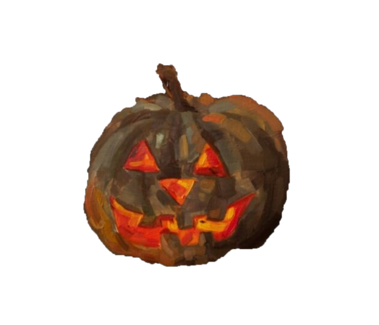
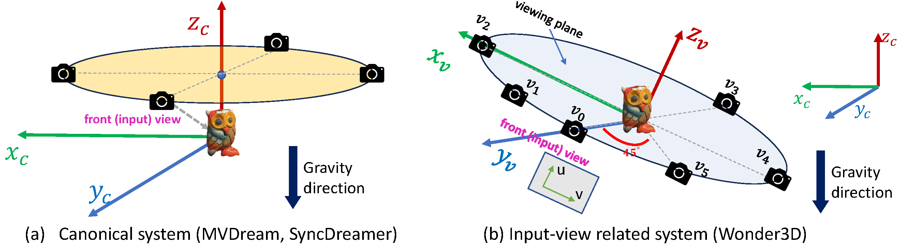
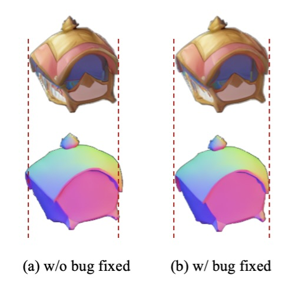

# Wonder3D

**Single-image 3D reconstruction** using a cross-domain multi-view diffusion model, followed by fast neural surface reconstruction.

This repository is a **personal, open-source** implementation and experimentation workspace. It is maintained independently (not by a company or research lab) and is intended for learning, reproducibility, and local development.

<p align="center">
  
</p>
<p align="center">
  <sub><em>End-to-end reconstruction: one image → consistent multi-view predictions → textured mesh.</em></sub>
</p>

---

## Overview

Wonder3D reconstructs a textured 3D mesh from one RGB image in roughly two stages:

1. **Multi-view generation** — A fine-tuned diffusion UNet predicts six orthographic views of **surface normals** and **colors** with cross-view, cross-domain attention for consistency.
2. **Surface reconstruction** — Generated views feed a Neuralangelo-style NeuS pipeline (`instant-nsr-pl`) to extract a mesh and vertex colors.

```text
Input image  →  MV diffusion (6× normal + 6× color)  →  NeuS / Neuralangelo  →  textured mesh (.obj)
```

Typical runtime is on the order of **2–3 minutes** for the full path (multi-view generation plus mesh extraction), depending on GPU, resolution, and optimization steps.


---

## Example inputs

Ready-to-use samples live in [`example_images/`](example_images/). The default quick-start uses `owl.png`; any centered, front-facing object on a clean background tends to work best.

<p align="center">
  
  
  
  
</p>
<p align="center">
  <sub><em>Representative inputs — run <code>bash run_test.sh</code> after placing checkpoints in <code>./ckpts</code>.</em></sub>
</p>

<p align="center">
  
  
  
  
</p>

---

## Features

- Cross-domain diffusion for joint normal and color multi-view synthesis
- Orthographic six-view setup aligned with the paper configuration
- Optional **Gradio** demos for interactive inference (multi-view only, or full reconstruction)
- Training scripts for stage-1 (mixed objectives) and stage-2 (joint) fine-tuning
- BlenderProc-based data rendering utilities for custom datasets
- Docker image for CUDA 11.7 environments

---

## Requirements

| Component | Notes |
|-----------|--------|
| **GPU** | NVIDIA GPU with ≥ 12 GB VRAM recommended for inference; more for training |
| **CUDA** | Tested with CUDA 11.7 and PyTorch 1.13.1 |
| **OS** | Linux preferred; Windows may work for inference with limitations on multi-GPU training in `instant-nsr-pl` |
| **Python** | 3.8+ |

Additional runtime dependencies include `tiny-cuda-nn`, `nerfacc`, `xformers`, and SAM weights for background removal in the Gradio apps (see [Installation](#installation)).

---

## Installation

### 1. Clone and create an environment

```bash
git clone <your-fork-url> Wonder3D
cd Wonder3D
python -m venv .venv
source .venv/bin/activate   # Windows: .venv\Scripts\activate
pip install -r requirements.txt
```

### 2. Install `tiny-cuda-nn` (required for mesh reconstruction)

```bash
pip install git+https://github.com/NVlabs/tiny-cuda-nn/#subdirectory=bindings/torch
```

Install the `nerfacc` wheel matching your PyTorch/CUDA build if the default install fails (see [docker/README.md](docker/README.md)).

### 3. Download pretrained weights

Place the Wonder3D v1.0 checkpoint under `./ckpts` so that `configs/mvdiffusion-joint-ortho-6views.yaml` can load it via `pretrained_model_name_or_path: './ckpts'`.

You can obtain compatible weights from the [Hugging Face Hub](https://huggingface.co/models?search=wonder3d) (search for `wonder3d-v1.0`) and download them, for example:

```bash
pip install huggingface_hub
huggingface-cli download <repo-id> --local-dir ./ckpts
```

Replace `<repo-id>` with the model repository you choose on the Hub.

### 4. Segment Anything (Gradio only)

Download `sam_vit_h_4b8939.pth` from the [SAM repository](https://github.com/facebookresearch/segment-anything#model-checkpoints) into `sam_pt/`.

---

## Quick start (inference)

1. Put test images in `example_images/` (or edit `filepaths` in the config).
2. Run:

```bash
bash run_test.sh
```

Outputs are written under `outputs/` (multi-view grids and per-view images). Adjust `configs/mvdiffusion-joint-ortho-6views.yaml` for guidance scales, crop size, and file list.

```bash
# Single image (edit filepaths in the config as needed)
accelerate launch --config_file 1gpu.yaml test_mvdiffusion_seq.py \
  --config configs/mvdiffusion-joint-ortho-6views.yaml \
  validation_dataset.root_dir=./example_images \
  validation_dataset.filepaths=['owl.png'] \
  save_dir=./outputs
```

---

## Mesh reconstruction

After multi-view generation, reconstruct a mesh with the bundled `instant-nsr-pl` stack:

```bash
cd instant-nsr-pl
python launch.py --config configs/neuralangelo-ortho-wmask.yaml --gpu 0 --train \
  dataset.root_dir=../outputs/<your-run>/cropsize-<size>-cfg<scale>/ \
  dataset.scene=<scene_name>
```

Exported meshes appear under `instant-nsr-pl/exp/<scene>/`. Tune `dataset.root_dir`, `dataset.scene`, and view weights in the YAML config as needed.

Meshes are produced in **orthographic camera space** — enable *Toggle Orthographic Camera* in MeshLab when inspecting exports. A NeuS-based path is also available under [`NeuS/`](NeuS/) for lower GPU memory use at the cost of longer runtime.

<p align="center">
  
</p>
<p align="center">
  <sub><em>Exported meshes can be used for visualization, asset pipelines, or physical fabrication (results vary by input quality and print settings).</em></sub>
</p>

---

## Gradio demos

| Script | Purpose |
|--------|---------|
| `gradio_app_mv.py` | Multi-view normal and color generation only |
| `gradio_app_recon.py` | Full pipeline including mesh reconstruction |

```bash
python gradio_app_mv.py
# or
python gradio_app_recon.py
```

Both apps read `configs/mvdiffusion-joint-ortho-6views.yaml` and expect `./ckpts` and `sam_pt/` to be configured.

---

## Camera convention

Generated views live in an **input-view–aligned orthographic camera system** (not a global canonical frame). Six views are sampled on the plane of the input image with fixed azimuth offsets; the front view matches the input pose.

<p align="center">
  
</p>

| Topic | Detail |
|--------|--------|
| **Elevation** | Views lie in the plane at 0° elevation relative to the input camera |
| **Azimuth** | Default offsets: 0°, 45°, 90°, 180°, −90°, −45° |
| **Projection** | Orthographic; meshes export in orthographic space (use an orthographic camera in MeshLab when inspecting) |

**Tips for better results:** prefer front-facing inputs with a centered subject, minimal occlusion, and clear silhouettes. Inputs are resized to 256×256 for generation; increasing `trainer.max_steps` in `instant-nsr-pl/configs/neuralangelo-ortho-wmask.yaml` can improve texture at the cost of longer optimization.

---

## Implementation notes

When using **classifier-free guidance (CFG)** with cross-domain attention, RGB and normal domains must be batched correctly: place RGB inputs in the first half of the batch and normal inputs in the second half before the forward pass. The default pipeline layout follows this convention; misordering can desynchronize color and normal predictions.

<p align="center">
  
</p>
<p align="center">
  <sub><em>Effect of correct cross-domain CFG batching on RGB / normal consistency (see <code>mvdiffusion/pipelines/pipeline_mvdiffusion_image.py</code>).</em></sub>
</p>

For training, ensure `zero_init_camera_projection` is **`false`** in `configs/train/stage1-mix-6views-lvis.yaml` so domain and pose controls remain active.

---

## Training

Training assumes rendered multi-view Objaverse-style data. Update `root_dir` paths in the YAML configs to your dataset location.

| Stage | Script | Config |
|-------|--------|--------|
| 1 — mixed objectives | `bash run_train_stage1.sh` | `configs/train/stage1-mix-6views-lvis.yaml` |
| 2 — joint | `bash run_train_stage2.sh` | `configs/train/stage2-joint-6views-lvis.yaml` |

Multi-GPU training uses Accelerate; see `1gpu.yaml` and `8gpu.yaml`.

---

## Docker

A CUDA 11.7 development image is provided under `docker/`. Build from the repository root:

```bash
docker build -t wonder3d:cuda11.7 -f docker/Dockerfile .
docker run --gpus all -it wonder3d:cuda11.7 bash
```

See [docker/README.md](docker/README.md) for NVIDIA Container Toolkit setup and post-start `tiny-cuda-nn` installation.

---

## Data rendering (optional)

To render custom 3D assets for training, see [render_codes/README.md](render_codes/README.md). Scripts use [BlenderProc](https://github.com/DLR-RM/BlenderProc) with orthogonal or perspective cameras.

---

## Project layout

```text
Wonder3D/
├── assets/                  # README figures (teaser, pipeline, coordinates, …)
├── configs/                 # Inference and training YAML configs
├── mvdiffusion/             # UNet, pipeline, datasets
├── instant-nsr-pl/          # Neural surface reconstruction (fork of instant-nsr-pl)
├── render_codes/            # BlenderProc rendering scripts
├── example_images/          # Sample inputs for testing
├── gradio_app_*.py          # Interactive demos
├── train_mvdiffusion_*.py   # Training entry points
├── test_mvdiffusion_seq.py  # Batch inference
└── docker/                  # Container definition
```

---

## Citation

If you use the **Wonder3D method** in academic work, cite the original paper:

```bibtex
@article{long2023wonder3d,
  title={Wonder3D: Single Image to 3D using Cross-Domain Diffusion},
  author={Long, Xiaoxiao and Guo, Yuan-Chen and Lin, Cheng and others},
  journal={arXiv preprint arXiv:2310.15008},
  year={2023}
}
```

---

## License

This project is released under the [MIT License](LICENSE). Third-party submodules and dependencies retain their own licenses (`instant-nsr-pl`, Hugging Face `diffusers`, BlenderProc, etc.).

---

## Disclaimer

This is a **personal open-source** repository for education and experimentation. It is not an official release from the Wonder3D paper authors or their institutions. APIs, defaults, and documentation may differ from upstream projects; use at your own risk in production settings.
